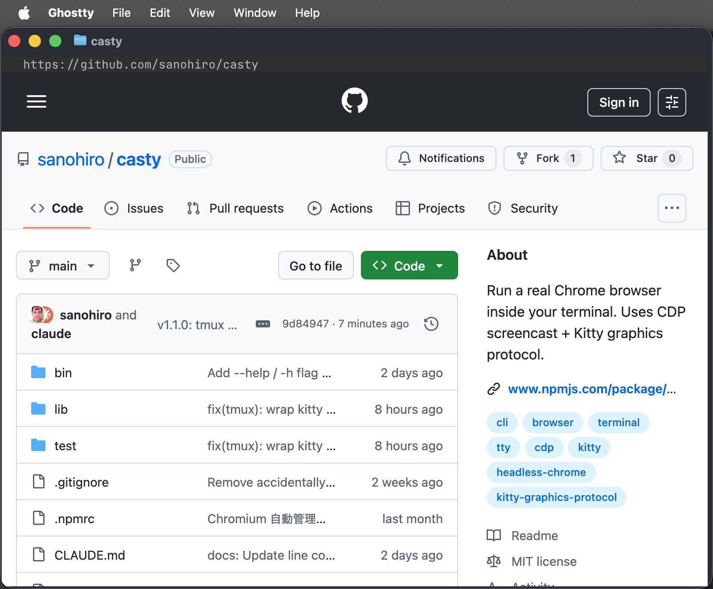
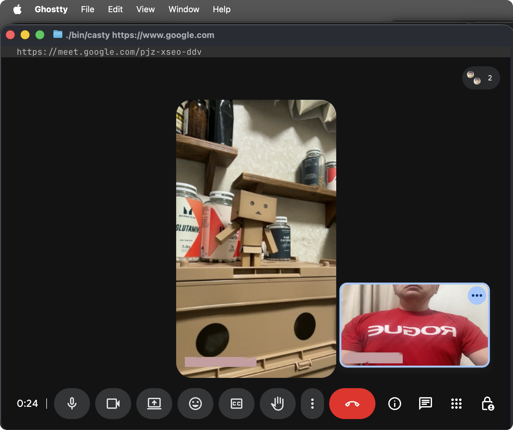

# casty

Run a real Chrome browser inside your terminal.

**[Japanese](README.ja.md)**

casty is not a text-mode browser like w3m or lynx. It launches headless Chrome, grabs the rendered frames over CDP, and draws them in your terminal via Kitty graphics protocol. Think of it as a remote desktop for Chrome that fits in a terminal window.



<video src="https://github.com/user-attachments/assets/552f1972-bb53-481e-9516-c36b7e5085d8" autoplay loop muted playsinline></video>

## How It Works

```
Terminal (you)          casty               Chrome (headless)
┌──────────────┐      ┌──────────────┐      ┌──────────────┐
│  Kitty       │ ←──  │  Screencast  │ ←──  │  Full web    │
│  graphics    │      │  + hi-res    │      │  rendering   │
│  display     │      │  capture     │      │  JS, CSS,    │
│              │ ──→  │  Input       │ ──→  │  Canvas,     │
│  Mouse/KB    │      │  bridge      │      │  WebGL       │
└──────────────┘      └──────────────┘      └──────────────┘
```

Chrome does all the rendering. casty is just a bridge (~2300 lines) that streams frames to your terminal and sends input back. No Playwright, no puppeteer — raw CDP over WebSocket.

Since it's real Chrome, JavaScript, CSS, Canvas, and WebGL all work. Google login works too (stealth patches bypass bot detection). Mouse clicks, scrolling, dragging, typing — everything you'd expect.

## Why use this?

If you're working over SSH on a headless server and need to check a web page, your options are usually `curl`, `lynx`, or forwarding X11. casty gives you an actual browser without leaving the terminal. No X11, no VNC, no Wayland — just a Kitty-compatible terminal.

### Google Meet with camera & mic (experimental)



With `"media": true` in `~/.casty/config.json`, casty can capture your camera and microphone via ffmpeg and stream them to WebRTC sites like Google Meet, Zoom, etc. Requires `ffmpeg` installed. Background effects are not available since the video is captured directly from the device.

## Installation

```bash
npm install -g @sanohiro/casty
casty
```

Or from source:

```bash
git clone https://github.com/sanohiro/casty.git
cd casty && npm install
./bin/casty
```

Chrome Headless Shell is auto-installed to `~/.casty/browsers/` on first run.

### Requirements

- A terminal with **Kitty graphics protocol** support (tested on Ghostty, kitty, bcon)
- Node.js >= 18
- `unzip` (for Chrome auto-install)

### tmux

If you run casty inside tmux, enable passthrough so Kitty graphics escape
sequences can reach your terminal:

```tmux
set -g allow-passthrough on
```

## Usage

```bash
casty https://google.com
casty https://youtube.com
casty   # opens home page
```

### Keybindings

| Key | Action |
|-----|--------|
| Alt+L | Address bar |
| Alt+F | Hint mode (Vimium-style) |
| Alt+Left / Right | Back / Forward |
| Alt+C | Copy selected text |
| Ctrl+V | Paste |
| Ctrl+Q | Quit |

Customizable via `~/.casty/keys.json`.

### Hint Mode

**Alt+F** shows labels on clickable elements. Type the label to click. Labels use home-row keys (`a s d f j k l`).

### Address Bar

**Alt+L** to open. Type a URL or search query. `/b query` searches bookmarks.

### Bookmarks

Create `~/.casty/bookmarks.json`:

```json
{
  "GitHub": "https://github.com",
  "YouTube": "https://youtube.com"
}
```

### Configuration

`~/.casty/config.json`:

```json
{
  "homeUrl": "https://github.com/sanohiro/casty",
  "searchUrl": "https://www.google.com/search?q=",
  "transport": "auto",
  "format": "auto",
  "mouseMode": 1002
}
```

| Key | Description | Default |
|-----|-------------|---------|
| `homeUrl` | Start page | `https://github.com/sanohiro/casty` |
| `searchUrl` | Search engine URL | `https://www.google.com/search?q=` |
| `transport` | Image transfer: `auto`, `file`, `inline` | `auto` (bcon/kitty→file, others→inline) |
| `format` | Capture format: `auto`, `png`, `jpeg` | `auto` (file→jpeg adaptive, inline→png) |
| `mouseMode` | `1002` (button-event) or `1003` (any-event) | Auto (Ghostty→1003, others→1002) |

## Comparison

| | casty | Browsh | w3m/lynx |
|---|---|---|---|
| Engine | Chrome | Firefox | Custom parser |
| Rendering | Pixel-perfect | Text approximation | Text only |
| JavaScript | Yes | Yes | No |
| Display | Kitty graphics | Character cells | Character cells |
| Dependencies | Node.js + Chrome | Go + Firefox | Standalone |

<details>
<summary>Technical Details</summary>

The whole thing is about 1200 lines of JavaScript. Here's what's going on under the hood:

- Launches chrome-headless-shell and talks to it via raw CDP WebSocket
- `Runtime.enable` is never sent (it breaks Google login — discovered the hard way)
- Stealth patches are injected via `Page.addScriptToEvaluateOnNewDocument` before any page loads
- Frame capture is hybrid: low-res Screencast triggers change detection, then `Page.captureScreenshot` grabs hi-res frames with proper DPR
- File transfer mode uses adaptive JPEG→PNG: fast JPEG during scrolling/video, crisp PNG after things settle
- Terminal pixel size is detected via CSI 14t for auto-zoom

```
bin/casty          Shell wrapper (Chrome install/update)
bin/casty.js       Entry point (terminal, zoom, resize)
lib/browser.js     CDP browser control, frame capture
lib/cdp.js         Lightweight CDP WebSocket client
lib/chrome.js      Chrome detection, launch, profile cleanup
lib/kitty.js       Kitty graphics protocol (file/inline)
lib/input.js       Mouse/keyboard handling
lib/hints.js       Vimium-style hint mode
lib/urlbar.js      Address/search bar
lib/config.js      User configuration
lib/keys.js        Keybinding config
lib/bookmarks.js   Bookmark search
```

</details>

## Troubleshooting

### No audio on YouTube (Ubuntu Server)

Chrome plays audio directly through the system audio server. If there's no sound:

```bash
sudo apt install pulseaudio
sudo usermod -aG audio $USER
# Log out and back in, then:
pulseaudio --start
```

### Chrome crashes

If casty fails to start or Chrome crashes, try removing the browser cache:

```bash
rm -rf ~/.casty/browsers
casty  # re-downloads Chrome automatically
```

To reset all settings and profile data:

```bash
rm -rf ~/.casty
```

## License

MIT
